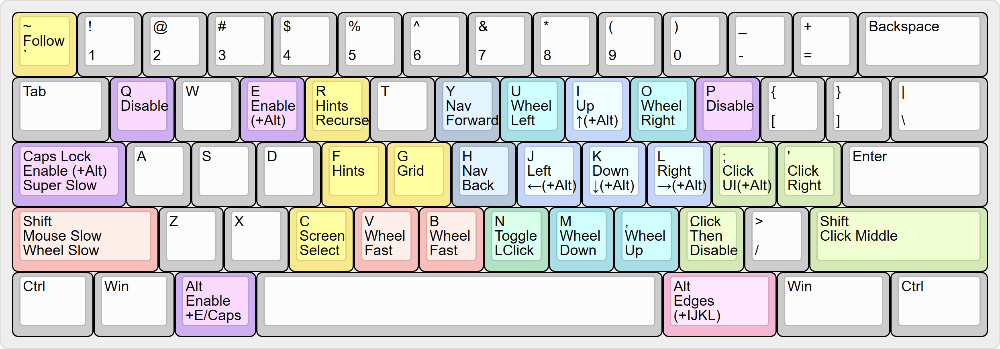

# neo-mousekeys-ijkl configuration for mousemaster ([neo-mousekeys-ijkl.properties](../configuration/neo-mousekeys-ijkl.properties))

(Refer to [configuration-reference.md](configuration-reference.md) for documentation on the complete list of configuration properties.)

## Overview

- Press _leftalt + e_ or _leftalt + capslock_ to activate.
- Press _i_, _j_, _k_, _l_ to move the mouse.
- Press _q_ or _p_ to deactivate.

## Normal Mode (hold _leftalt_ then press _e_, or hold _leftalt_ then press _capslock_)

- Press mouse buttons with _;_ (left button), _rightshift_ (middle button), _'_ (right button).
- Toggle left mouse button with _n_.
- Left click then deactivate with _._
- Jump to screen edges with _rightalt + i_, _rightalt + j_, _rightalt + k_, _rightalt + l_.
- Scroll vertically or horizontally (wheel) with _m_, _,_ (comma), _u_, _o_.
- Slow down mouse and scroll movement by holding _leftshift_ while moving.
- Super slow down mouse and scroll movement by holding _capslock_ while moving.
- Accelerate mouse movement by holding _v_ or _b_ while moving.
- Accelerate scroll movement by holding _v_ or _b_ while scrolling.

## Key remappings
- Press _leftalt + ijkl_ to simulate the arrow keys.
- Navigate back and forward using _h_ (back) and _y_ (forward). These keys send 
_leftalt + leftarrow_ (for back) and _leftalt + rightarrow_ (for forward) to the active application. 

## Grid Mode (_g_ in normal mode)

- Divide screen into a 2x2 grid, refining target area with each key press.
- Move mouse to the middle of the targeted grid section.
- Shrink the grid in one direction with _i_, _j_, _k_, _l_.
- Go back to normal mode with _g_ or _esc_.

## Window Mode (hold _leftshift_ then press _g_ in normal mode)

- Move mouse to the active window's edges with direction keys.
- Move mouse to the center of the active window with _g_.
- Go back to normal mode by releasing _leftshift_.

## Hint Mode (_f_ in normal mode)

- Display labels on the screen for direct mouse warping.
- Similar to Vimium-like browser extensions, but applicable to the entire screen.
- Trigger a second hint pass, subdividing the cell you selected into a finer grid, by holding _leftshift_ while selecting a hint.
- Undo an accidental key press with _backspace_.
- A balance between hint size, number and screen space is crucial and can be configured: see `hint.font-size`, `hint.grid-max-row-count`, and `hint.grid-max-column-count` in [neo-mousekeys-ijkl.properties](../configuration/neo-mousekeys-ijkl.properties).
- Go back to normal mode with _esc_ or _backspace_.

## Recursive Hint Mode (_r_ in normal mode)

- Display a 3x3 grid over the screen, positioned like the _u_, _i_, _o_, _j_, _k_, _l_, _m_, _,_, _._ keys.
- Press one of those keys to narrow the grid to that ninth of the current area, and repeat (up to five times) until the mouse is on target.
- The mouse follows the center of the current area, so the drill can be left at any depth. Press _`_ (backtick) to leave the mouse where it is instead.
- Press mouse buttons without leaving the drill, with the same keys as in normal mode.
- Go back one level with _backspace_, back to the whole screen with _space_.
- Go back to normal mode with _esc_.
- Set `virtual-key.showrecursivehintkeys` to `released` in [neo-mousekeys-ijkl.properties](../configuration/neo-mousekeys-ijkl.properties) to replace the keys drawn in each cell with a plus over the current area and a dot per cell.

## UI Hint Mode (hold _leftalt_ then press _f_ in normal mode)

- Display labels on interactive UI elements (buttons, links, etc.) of the active window.
- Select a hint to move the mouse to that UI element.
- Undo an accidental key press with _backspace_.
- Go back to normal mode with _esc_ or _backspace_.

## Screen Selection Mode (_c_ in normal mode)

- Display one large hint label on each screen for quickly moving from one screen to another.
- Go back to normal mode with _c_, _esc_ or _backspace_.

## Center Mouse after Alt-Tab

- After using Alt-Tab to switch windows, the mouse is automatically centered on the newly active window.
- This works by detecting the Alt-Tab combo, waiting for _leftalt_ to be released, then waiting for the Alt-Tab menu (Explorer.EXE) to lose focus before centering the mouse.